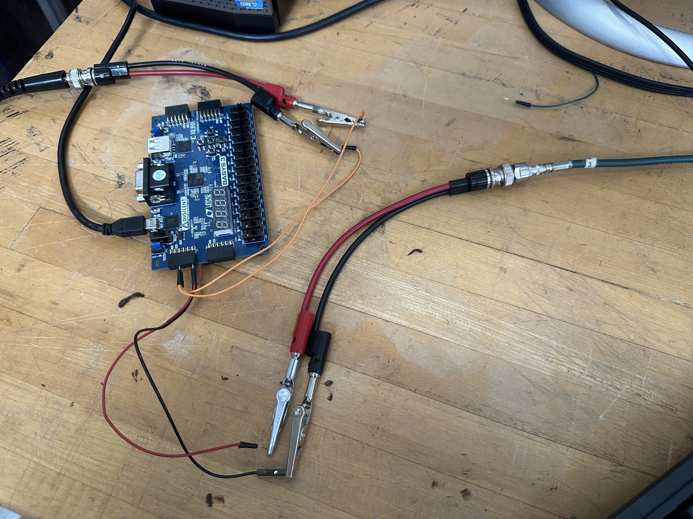
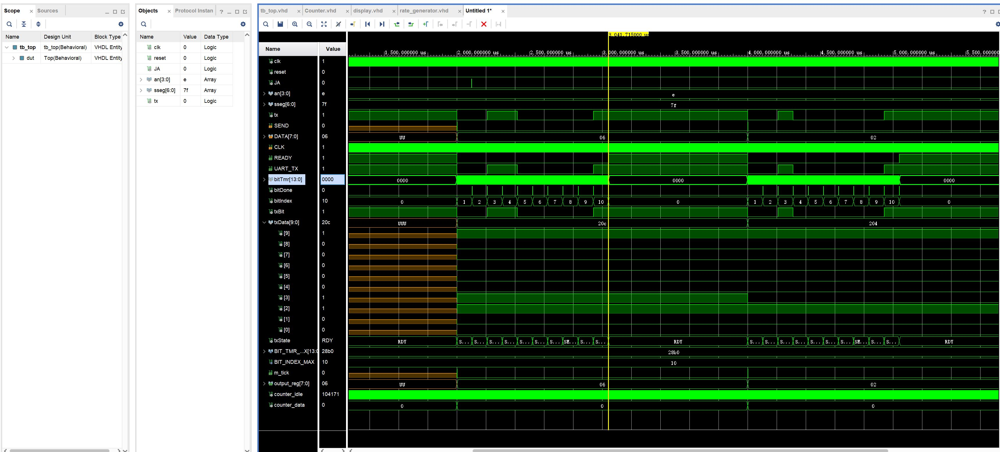
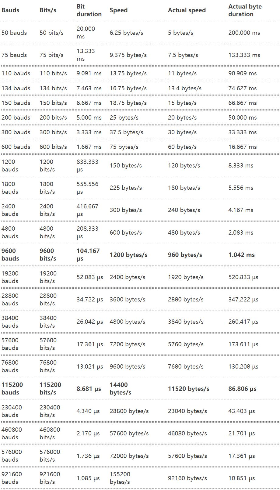

# SMDT_FPGA single_counter Branch
This file's goal is to provide clear documentation of the VHDL code developed by Rongqian Qian, Colin Bare, and Alexis Arndt, intended for use in MSU prototype cosmic ray station. As it currently stands, my forked repository, two_scintillator branch, has been adapted to a 2 scintillator array (eventually enclosing the mini chamber) for which the FPGA displays the counts of. We want to transmit this count to the PC as events, to be able to access cosmic ray data.

## Prerequisites
If you are not familiar with FPGA, The tutorial branch is here for view.

## Design files

Here is a brief description of all of the design files.

    TOP file: hex.vhd - connects all of the design files to the outside world. <ins> Many edits made in design files will also require edits to this file. <ins>
    counter.vhd - Contains the logic for the coincidence counter
    displayer.vhd - Contains the code for the seven segment display controls
    UART_TX_CTRL.vhd - Contains the data transmitter logic
    rate_generator.vhd - File that establishes the data transmission rate (we want to use 9600 baud [bits/s])

## Constraint file

There is only one constraint file for this project: b3.xdc. This file most directly corresponds to the Digilent Basys 3 FPGA that we are using. Many lines contain comments referncing pins and switches, whose labels can be found both in the comments of this file and labeled on the FPGA board. I will outline the most notable parts:

    Package Pin V17 - Our programmed "RESET" switch, setting it as the farthest right switch on the board
    an[0-3] Ports - Each an corresponds to one "8" on the seven segment display
    sseg[0-6] - Corresponds to the segment on each seven segment "8"
    JA[0-2] - Connections from FPGA to scintillators (and eventually mini-chamber)
    TX - Data transmitter pin
    RX - Data receiver pin

## Running

Connect the FPGA board as shown below. JA port is connected with the scintillators. We write code to connect that to the serial output, in the form of the various digital circuits (vhd files) that we've written. WARNING: Input voltage should be 3.3V

To run your complete code with the FPGA, first run synthesis, then implementation, then generate bitstream. Open the hardware manager, select "open target" and then "program device" and your code will then run.

NOTE: make sure the power supply connected the scintillators is on so signals are detected.

The real counter should be the number on the display divide by 10 by default. Line 135 of counter.vhdl is the setting of divider and can be set to any value based on the signal rate.  

## Simulation:

The basic idea of a Vivado behavioral simulation is to instantiate an instance of our design, and test its functionality before writing the design to FPGA. A complete simulation file exists in the simulation sources of our project: tb_top.vhd. The tb here stands for test bench, and many developers will refer to it this way. The output of the simulation file is a waveform: a display that keeps track of the changing signals across the module [changes from 0 to 1, interpreting bit-strings as numbers, etc.] The purpose of this functionality is to manually change the inputs of the circuit, to see if the behavioral simulation produces the correct output. In essence, this is a nice way to tell if your code is working as intended.

There is a saved waveform in the project, so running the behavioral simulation will have all necessary variables. The factor of the counter is 1, so the real number of events is 1 times the number on the sseg. Change to 10 before you start the real test for two scintillators (line 138 of counter.vhd). 

## Listed below are the pieces of code that still need further attention and development

## Universal Asynchronous Receiver/Transmitter (UART)

Two files are associated with UART in this project (other than the top file):
    - UART_TX_CTRL (Transmitter)
    - UART_RX_CTRL (Receiver)
A system for transmitting the event data bit-by-bit ("0" or "1"). We want to read in data as events to the computer, to be outputed into txt files (for now, may wanna make a spectrum later). Txt files should contain trigger time, arrival time.

Each databus contains a start bit, 8 data bits, and a stop bit

For UART, if using 9600 bauds, Actual byte duration bit duration is 1041.67 $\mu s$, chage the  rate_generator line 68(default is 2000 $\mu s$) so readout cycle time is larger than this.

Also since it only contains 8 bits data (256), don't make the signals number more than this number in one readout cycle. You can change line 68 in rate_generator for readout cycle time (10ns*number to input) and output signals number divider in counter.vhd line 138.

Currently, there is some communication between the FPGA and computer, but there are some inconsistencies. When Tera Term is connected (terminal used to receive data from UART), only bytes come thorugh for 14400 and 38400 baud. For 14400 baud, the data comes through as spaces, and the log shows unknown characters. For 38400 baud, only x's and spaces come through the terminal/log. 
