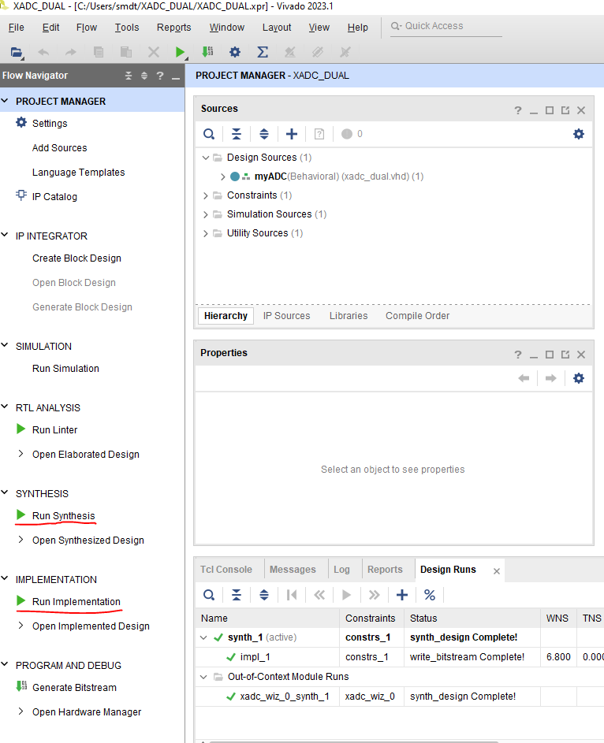
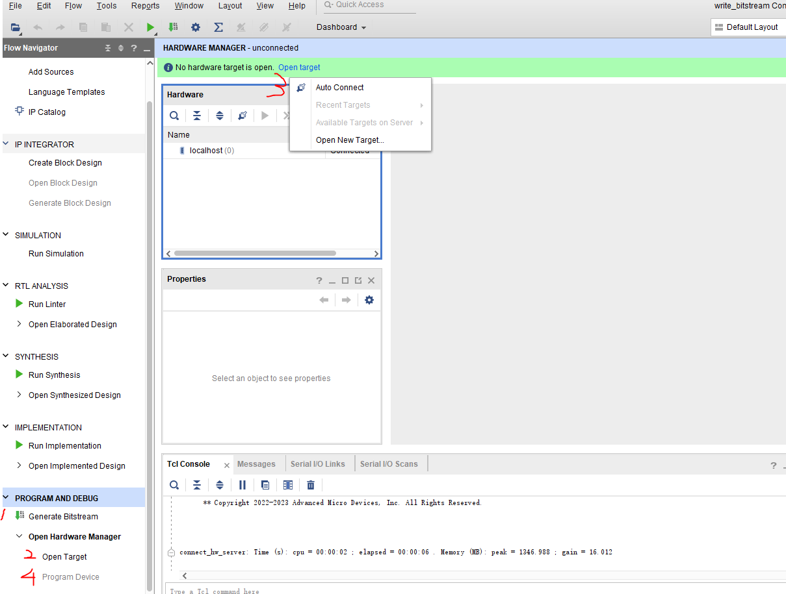

# SMDT_FPGA xadc_dual Branch
This branch contains the code for the dual channel digital readout by Basys3.

## Prerequisites
If you are not familiar with FPGA, The tutorial branch is here for veiw.

## Running
1. Create a new project and load src file and constrain file into the project. 

3. Run Synthesis and Run Implementation (click red-lined butoon in the left panel)

4. Connect the fpga board as shown below. JA port is connected with the digital output. WARNING: Input voltage should be 3.3V

5. Make Sure JP1 is in JTAG mode and Turn on the Basys3. Generate Bitstream and program device. Click the botton as shown in the picture. 

6.The real counter should be the number on the display divide by 10 by default. Line 89 of counter.vhdl is the setting of divider and can be set to any value based on the signal rate.  
