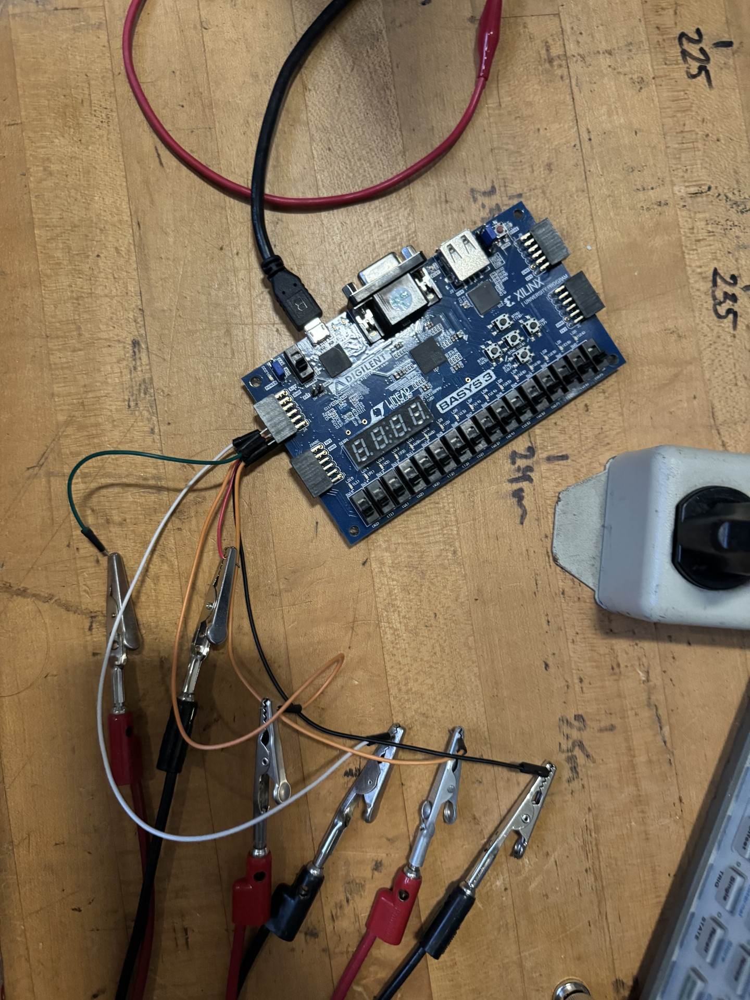
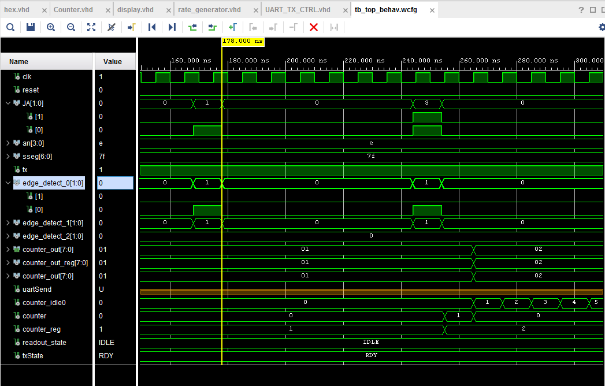

# SMDT_FPGA two_scintillator Branch
This file's goal is to provide clear documentation of the VHDL code developed by Rongqian Qian, Colin Bare, and Alexis Arndt, intended for use in MSU prototype cosmic ray station. As it currently stands, my forked repository, two_scintillator branch, has been adapted to a 2 scintillator array (eventually enclosing the mini chamber) for which the FPGA displays the counts of. We want to transmit this count to the PC as events, to be able to access cosmic ray data.

## Prerequisites
If you are not familiar with FPGA, The tutorial branch is here for view.

## Design files

Here is a brief description of all of the design files.

    TOP file: hex.vhd - connects all of the design files to the outside world. <ins> Many edits made in design files will also require edits to this file. <ins>
    counter.vhd - Contains the logic for the coincidence counter
    displayer.vhd - Contains the code for the seven segment display controls (still exists, but is not used in current project since we got a new FPGA board)
    UART_TX_CTRL.vhd - Contains the data transmitter logic
    rate_generator.vhd - File that establishes the data transmission rate (we want to use 9600 baud [bits/s])

## Constraint file

There are two constraint files for this project: b3.xdc and Arty-A7-100-Master.xdc. The b3.xdc file corresponds to the Digilent Basys 3 FPGA that we have used previously. 
The constraint file we want to use, Arty-A7-100-master.xdc, corresponds to the Digilent Arty A7 FPGA. Many lines contain comments referncing pins and switches, whose labels can be found both in the comments of this file and labeled on the FPGA board. I will outline the most notable parts:

    1. Clock Signal
    Package Pin E3 - clk (creating 100MHz internal clock signal)
    2. Switches
    Package Pin A8 - Our programmed "RESET" switch, setting it as the farthest right switch from the power indicator light
    3. Pmod Header JA
    Package Pin G13 and B11 - JA[0-1] (Connections from FPGA to scintillators (and eventually mini-chamber))
    4. USB-UART Interface
    Package Pin D10 - tx (Data transmitter pin)

## Running

Connect the FPGA board as shown below. JA port is connected with the scintillators. We write code to connect that to the serial output, in the form of the various digital circuits (vhd files) that we've written. The top scintillator corresponds to JA[0]and the bottom to JA[1]. From the same PMT, there is a positive (red) and ground (black) wire. Attached are smaller wires that attach to the JA component of the board. The color connections for JA[0] are black(-) and orange(+) and JA[1] are red(-) and green(+). 
WARNING: Input voltage should be 3.3V

To run your complete code with the FPGA, first run synthesis, then implementation, then generate bitstream. Open the hardware manager, select "open target" and then "program device" and your code will then run.

NOTE: make sure the power supply connected the scintillators is on so signals are detected (power on the bottom left, then select the blue 5V button on the right). You can find more detailed instructions here: https://docs.google.com/document/d/1Hb8R0S-eUh0nreHfQq15rM5D3aqoJARjpncq5AhbR80/edit?usp=sharing 

  

## Simulation:

The basic idea of a Vivado behavioral simulation is to instantiate an instance of our design, and test its functionality before writing the design to FPGA. A complete simulation file exists in the simulation sources of our project: tb_top.vhd. The tb here stands for test bench, and many developers will refer to it this way. The output of the simulation file is a waveform: a display that keeps track of the changing signals across the module [changes from 0 to 1, interpreting bit-strings as numbers, etc.] The purpose of this functionality is to manually change the inputs of the circuit, to see if the behavioral simulation produces the correct output. In essence, this is a nice way to tell if your code is working as intended.

There is a saved waveform in the project, so running the behavioral simulation will have all necessary variables. The factor of the counter is 1, so the real number of events is 1 times the number on the sseg. Change to 10 before you start the real test for two scintillators (line 86 of counter.vhd).

The image above shows this saved waveform, with two simulation 'hits'. The first instance can be seen at 168ns, where a particle is detected by just one of the scintillators, and it can be observed that the counter does not update. The next instance of a 'hit' is at 244ns, where a particle is detected by both scintillators. In this case, the counter will increase by 1, and counter_idle0 will begin the count to 100ns (to account for the sporadic trailing signals received during the actual test). When testing the simulation, this was changed from 100 to 10 so the hits could be counted. This can be changed in line 79 of counter.vhd.

## Universal Asynchronous Receiver/Transmitter (UART)

Two files are associated with UART in this project (other than the top file):
    - UART_TX_CTRL (Transmitter)
    - UART_RX_CTRL (Receiver)
A system for transmitting the event data bit-by-bit ("0" or "1"). We want to read in data as events to the computer, to be outputed into txt files (for now, may wanna make a spectrum later). Txt files should contain trigger time, arrival time.

Each databus contains a start bit, 8 data bits, and a stop bit.

For UART, if using 9600 bauds, actual byte duration bit duration is 1041.67 $\mu s$; change the rate_generator line 68(default is 2000 $\mu s$) so readout cycle time is larger than this.

Also since it only contains 8 bits data (256), don't make the signals number more than this number in one readout cycle. You can change line 68 in rate_generator for readout cycle time (10ns*number to input) and output signals number divider in counter.vhd line 86.

To see the counts in real time, open VS Code, find file "cosmic_ray_gui.py," and run it. A terminal should open and output the number of counts per second for a minute. 

## Listed below are the pieces of code that still need further attention and development

## Count Output (UART)

While the UART is communicating correctly with the computer, we want each count to come through individually, not just per second. Each count should have an event ID, along with a timestamp, which will be saved to a file (.txt or .csv). This file should be able to be manipulated to output any type of analysis (could be counts per second, minute, etc.). 

