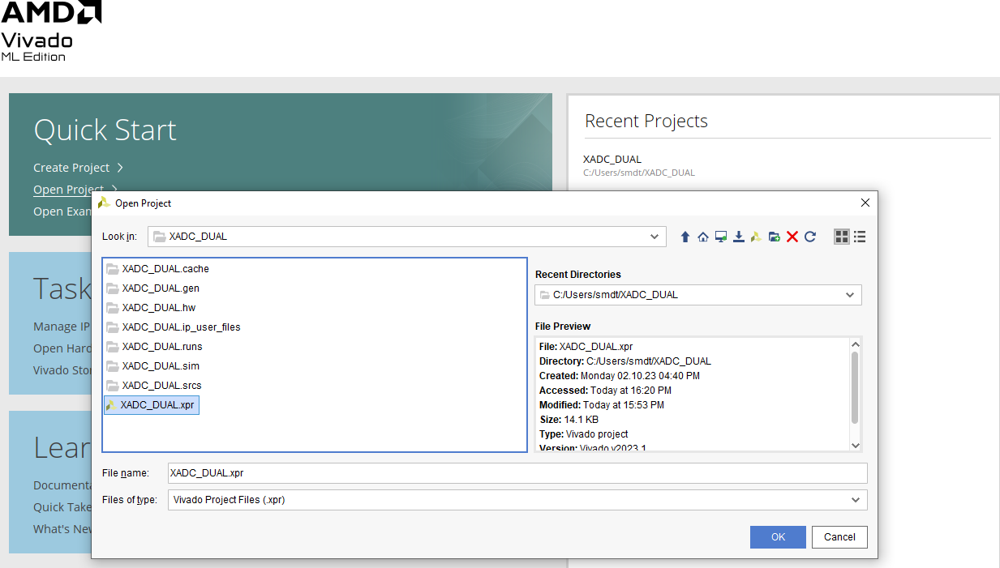

# SMDT_FPGA xadc_dual Branch
This branch contains the code for the dual channel xadc readout by Basys3.

## Prerequisites
If you are not familiar with FPGA, The tutorial branch is here for veiw.

## Running
1. Clone the git repository to /your/path.
 ```
git clone https://github.com/Rong-qian/sMDT_FPGA.git
git checkout xadc_dual
```
2. Open vivado and open the XADC_DUAL.xpr under XADC_DUAL folder.



3. Run Synthesis and Run Implementation (click red-lined butoon in the left panel)


4. Connect the fpga board as shown below. The uart should be connect to PC. In the illustration Two inputs are from the wavegenerator and is connect to JA PMOD connector. Two colomns are two channels and the positive should be connected to the upper connector. Detail see: https://digilent.com/reference/programmable-logic/basys-3/demos/xadc


5. Make Sure JP1 is in JTAG mode and Turn on the Basys3. Generate Bitstream and program device. Click the botton as shown in the picture. 


6.The input signal should be between 0-1V. The LED[0-7] and LED[8-15] will shows the bit of two channel ADC.  

## Material 

1. https://www.unilim.fr/pages_perso/vahid.meghdadi-neyshabouri/XADCinBasys3.html

    The code is based on this website. See the youtube video inside it for more detail if you want to know how to use XADC.

2. https://docs.xilinx.com/r/en-US/ug480_7Series_XADC/Instantiating-the-XADC

    Official document of XADC by Xilinx.

## Next step

1. Add uart output to show results and save in PC. 